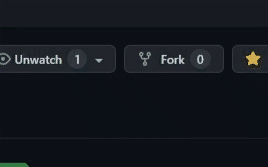
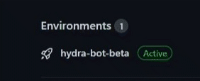
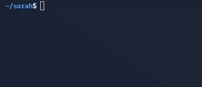

 <a href="https://dottedco.github.io/">Our website</a> — <a href="https://dottedco.github.io/sarah/">sarah project's website</a> 

Welcome to the main website of the **sarah** project, a *highly reliable*, *easily configurable*, and *extremely lightweight* discord bot written from scratch in the *JavaScript* programming language with just a few dependencies. The **sarah** project is completely *open source*, so feel free to make any changes, report any bugs or strange behaviors, and make suggestions about what you would like to see implemented in the future in this project. Also, if you want to help us indirectly, you can always **give this repository a star** and **share it with your friends**, that would help us a lot.

 
 

<h2 align="center"> installation </h2>
In the following steps we will guide you through the <i>(very simple)</i> process to successfully <b>install</b> and <b>configure</b> the <b>sarah</b> bot on your favorite discord server.
 

1. [Forking and installation](#-forking-and-installation-)
2. [Configuration](#-configuration-)
3. [Bot deployment](#-bot-deployment-)
4. [Adding more commands](#-adding-more-commands-)

 

<h4 align="center"> Forking and installation </h4>
To install <b>sarah</b> on your favorite discord server, you will first have to <i>fork</i> this repository, a simple task that can be done by clicking on the <code>fork</code> button of this repository, as shown in the image below:

Then, wait a bit until the forking process has finished and thus, you have created your own branch of this bot. Now, you can give the repository the name you want and we can continue with the next step.

 

<h4 align="center"> Configuration </h4>
After having created your own fork of the <b>sarah</b> bot, it's time to configure it to adapt it to the needs of your own server, in general, we would like to tell you that you can do this by editing the file <code>sarah/settings/settings.json</code>, however, you are probably looking for one more rigorous and specific documentation on what each of the sections is for, if this is what you want, you should take a look at the <a href="docs/settings.md">documentation page of the settings.json module</a>.

 

<h4 align="center"> Bot deployment </h4>
And finally you will only have to mount your deployment workflow on your <b>sarah</b> fork (this can be done using platforms like <a href="https://www.heroku.com/">Heroku</a> or <a href="https://www.netlify.com/">Netlify</a>) and your discord bot should be successfully deployed, so you should see an environment like the one below in your repository:

 

<h4 align="center"> Adding more commands </h4>
Also, you probably want to add more commands to your bot than <b>sarah</b> has, this is a simple task, but one that you can do manually or using the <b>CLI</b> that <b>sarah</b> includes:

 

<h6 align="center">Adding commands manually</h6>
<ol>
  <li> Firstly, you need to create its own JavaScript module in the <code>./sarah/commands/</code> directory, which must be called <code>[command].js</code>.</li>
  <li> Then, write the command program within its main function, which must be called <code>[command]cmd</code> and must recieve five arguments: <code>message, args, client, _, __</code> <i>(the last two arguments are useless, but your function must recieve them; otherwise it will generate an error)</i>. </li>
  <li> And finally go to the <code>commands</code> section of the <code>settings.json</code> module and add your command there as an object with the following properties:</li></ol>
<ul>
  <li><b>name</b>: <code>string</code></li>
  <li><b>desc</b>: <code>string</code></li>
  <li><b>path</b>: <code>string</code></li>
  <li><b>admin</b>: <code>bool</code></li>
  <li><b>state</b>: <code>0</code> or <code>1</code></li>
  <li><b>log</b>: <code>bool</code></li>
  <li><b>logicon</b>: <code>string</code></li>
  <li><b>logmsg</b>: <code>string</code></li>
  <li><b>logcolor</b>: <code>string</code></li>
  <li><b>ondev</b>: <code>bool</code></li>
</ul>

 
<h6 align="center">Adding commands using <b>sarah</b>'s <b>CLI</b></h6> 
<ol>
  <li>First of all, you will have to make sure that the dependencies of the project are installed, if they are not, you can solve the problem by executing the <code>$ npm i</code> command</li>
  <li>Then, you will have to obtain the name of the user who created the project and the name of the repository of the command to install, this obviously on the <b>GitHub</b> platform, from where the command will be obtained.</li>
  <li>And finally execute the command <code>node ./addcmd.js [user] [repo]</code> replacing <code>[user]</code> with the user in question and <code>[repo]</code> with the name of the repository, you can see an example below:
  

</li>
</ol>

If you followed the steps correctly either way, you should have your command <b>ready to run</b> on your server.

 
 

<h2 align="center"> commands </h2>
The <b>sarah</b> bot comes by default with a wide variety of useful commands for your server, which we are detailed below. With this purpose in mind, we would like to detail the notation used below:
<ul>
  <li> <code>s!</code> will be the default prefix in this notation. </li>
  <li> <code>s!command [param]</code> means this command requires a parameter. </li>
  <li> <code>s!command (param)</code> means this command supports an optional parameter. </li>
  <li> 👮 <code>s!command</code> means this command can only be run by administrators </li>
</ul>
With this notation already detailed, let's go with the commands:
<ul>
  <li> 👮 <code>s!ban [user]</code>: When you insert a tag after the command, you ban the pinged user. </li>
  <li> 👮 <code>s!kick [user]</code>: When you insert a tag after the command, you kick the pinged user. </li>
  <li> 👮 <code>s!cls [number]</code>: If you write a number between 1-250 after typing this command, you delete that number of msgs. </li>
  <li> 👮 <code>s!lock (channel)</code>: If you type this command on a channel, that channel gets locked. </li>
  <li> 👮 <code>s!unlock (channel)</code>: If you type this command on a channel, that channel gets unlocked. </li>
  <li> 👮 <code>s!warn [user]</code>: When you insert a tag after the command, you warn the pinged user. </li>
  <li> 👮 <code>s!unwarn [user]</code>: When you insert a tag after the command, you unwarn the pinged user. </li>
  <li> 👮 <code>s!warns (user)</code>: The bot sends an embed with the warndes users in every server it is. </li>
  <li> 👮 <code>s!wjson </code>: The bot sends a JSON object with the warned users in every server it is. </li>
  <li> 👮 <code>s!setwarns [file]</code>: Given an attached JSON file, the server warnings will be replaced by the given in that file. </li>
  <li> 👮 <code>s!shutdown</code>: Just shutdown the bot until the <code>turnon</code> command is called. </li>
  <li> 👮 <code>s!turnon</code>: Turns on the bot again. </li>
  <li> 👮 <code>s!settings</code>: The bot sends you an embed with this bot's settings. </li>
  <li> <code>s!ping</code>: Simply replies with <code>pong</code>.</li>
  <li> <code>s!help</code>: This command shows you <b>sarah</b>'s commands.</li>
  <li> <code>s!pf [user]</code>: If you ping a user before the command, you see his/her profile photo.</li>
  <li> <code>s!cmds</code>: You're actually using this command.</li>
  <li> <code>s!bans</code>: The bot sends a list with all the banned users.</li>
  <li> <code>s!ascii [text]</code>: The bot sends a beauty text.</li>
  <li> <code>s!meme</code>: Sends a random meme.</li>
  <li> <code>s!userinfo [user]</code>: The bot sends an embed with the user's properties.</li>
  <li> <code>s!srvinfo</code>: The bot sends an embed with the server's properties.</li>
  <li> <code>s!rand (number) (number)</code>: The bot sends a random number between a given interval.</li>
  <li> <code>s!dice</code>: The bot sends a random number from <code>0</code> to <code>6</code>.</li>
  <li> <code>s!develop</code>: The bot sends an embed with the commands wich are on development.</li>
  <li> <code>s!emojis</code>: The bot sends an embed with all of this server's exclusive emojis.</li>
  <li> <code>s!ytsearch (text)</code>: Searches YouTube for a video related to the given query.</li>
</ul>

 
 

<h2 align="center"> license </h2>

#### Copyright (c) 2022 dotted software

Permission is hereby granted, free of charge, to any person obtaining a copy
of this software and associated documentation files (the "Software"), to deal
in the Software without restriction, including without limitation the rights
to use, copy, modify, merge, publish, distribute, sublicense, and/or sell
copies of the Software, and to permit persons to whom the Software is
furnished to do so, subject to the following conditions:

The above copyright notice and this permission notice shall be included in all
copies or substantial portions of the Software.

THE SOFTWARE IS PROVIDED "AS IS", WITHOUT WARRANTY OF ANY KIND, EXPRESS OR
IMPLIED, INCLUDING BUT NOT LIMITED TO THE WARRANTIES OF MERCHANTABILITY,
FITNESS FOR A PARTICULAR PURPOSE AND NONINFRINGEMENT. IN NO EVENT SHALL THE
AUTHORS OR COPYRIGHT HOLDERS BE LIABLE FOR ANY CLAIM, DAMAGES OR OTHER
LIABILITY, WHETHER IN AN ACTION OF CONTRACT, TORT OR OTHERWISE, ARISING FROM,
OUT OF OR IN CONNECTION WITH THE SOFTWARE OR THE USE OR OTHER DEALINGS IN THE
SOFTWARE.

 

<a href="docs/settings.md"><code>settings.json</code> documentation</a> — <a href="docs/creating.md">create your own commands</a> — <a href="https://github.com/topics/sarahcmd">other commands</a>

