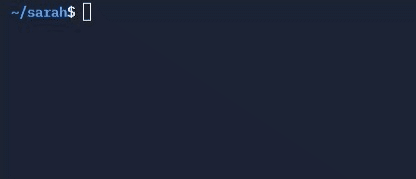

<h1 align="center">create your own commands</h1>
Welcome to the official guide to creating commands for the <b>sarah</b> discord bot and their distribution through the GitHub platform. In addition, here we will also teach you how to install your own extensions and how to distribute them so that they gain popularity.
<ol>
<li> First of all, you must create a GitHub repository in which your extension will be hosted, you can see an example below:

</li>
<li>Then you will have to add the following files to your repository, in which the magic of your extension will be found:
<ul>
<li> <b>settings.json</b>: Your extension's configuration file, which should contain all the fields found in any command object in <b>sarah</b>'s settings module, but without the <code>path</code> field</li>
<li> <b>requirements.json</b>: The module in which the requirements of your extension have to be found, which will later be added to the bot's <code>package.json</code> module.</li>
<li> <b>index.js</b>: The module in which all the logic of the command must be programmed, this must be found in the main function, which must be called <code>[command]cmd</code> and must recieve five arguments: <code>message, args, client, _, __</code> <i>(the last two arguments are useless, but your function must recieve them; otherwise it will generate an error)</i>.</li>
</ul>
You can add these files and more to your repository by clicking the <i><code>Add file</code></i> button at the top of your repository, as shown in the following example:

It will also be very useful to add a <code>LICENSE.md</code> and <code>README.md</code> file to your project to specify the license of your extension and specify how to install and how to use your extension respectively.
</li>
<li>And your command should be ready to be executed, just run the command <code>node ./addcmd [your username] [your repo]</code> obviously replacing <code>[your username]</code> with your username and <code>[your repo]</code> with the repository name of your extension in a <b>sarah</b> bot and it should install correctly. An example shown below:

</li>
</ol>

With this you should have successfully created a nice <b>sarah</b> bot extension, if you want to learn more about how to add more extensions to your <b>sarah</b> bot, go to the <code>Adding more commands</code> section of <a href="../README.md">this site</a>.

<a href="https://dottedco.github.io/sarah/">sarah project's website</a> — <a href="docs/settings.md"><code>settings.json</code> documentation</a> — <a href="https://github.com/topics/sarahcmd">other commands</a>

